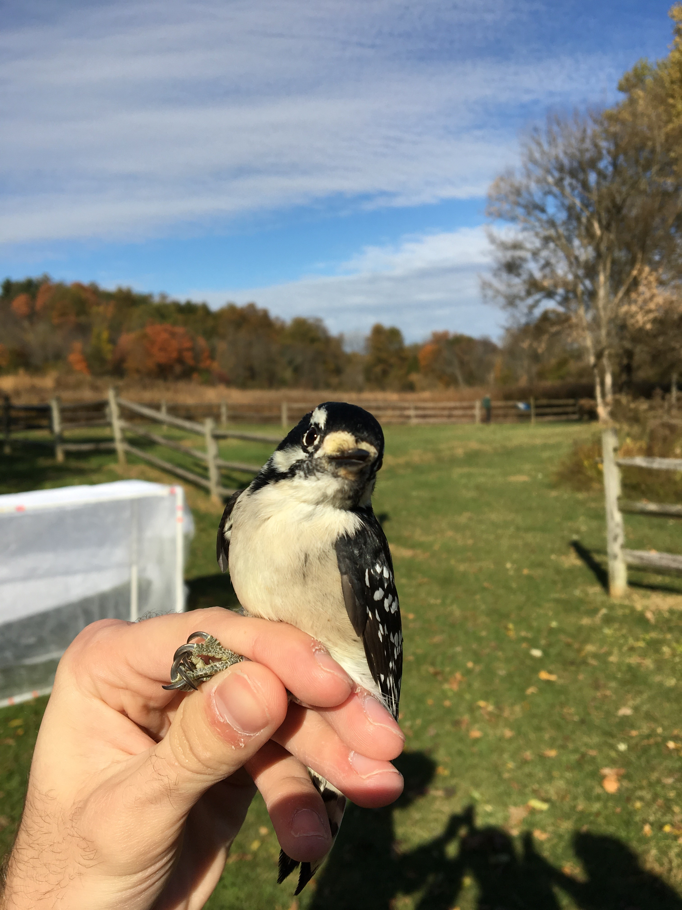

Thank you for visiting! 

My name is Jonah- I'm a biology student from Colorado. I studied at Kenyon College as a member of the class of '22. I was privileged enough to be allowed to conduct research while studying there, where I did research into bird flight and evolution. I worked as a TA for the intro biology sections, where we covered techniques ranging from PCR to culture growth to species identification to dissections. 

I've been involved in a lot of different projects over the years. I write a lot, and I've done R work for projects involving bird flight and MIBI cancer research. 

{ width=12cm }

I've received experience working with mist nets from my time at Kenyon. This Downy Woodpecker (*Picoides pubescens*) was one of the subjects of an experiment I was running, where I was examining stationary takeoff in common bird species. 

During Spring of 2020, shortly before the SARS-CoV-2 lockdown, I was allowed to participate in my lab's trip to the Smithsonian's Division of Birds, where we worked with their skeletal collection. The data we collected was primarily focused on the wing and leg bones, as well as the skull and keel. 

During the Summer of 2020, I had the honor of working with [Julia Wrobel](http://juliawrobel.com/), Christian Rickert, [Kimberly Jordan](https://profiles.ucdenver.edu/display/229958), and [Elena Hsieh](https://medschool.cuanschutz.edu/immunology-and-microbiology/faculty/hsieh) on research involving MIBI. I focused almost entirely on R coding and thresholding, in the hope that my work and R code could eventually be used to automate the process of IDing cells. 